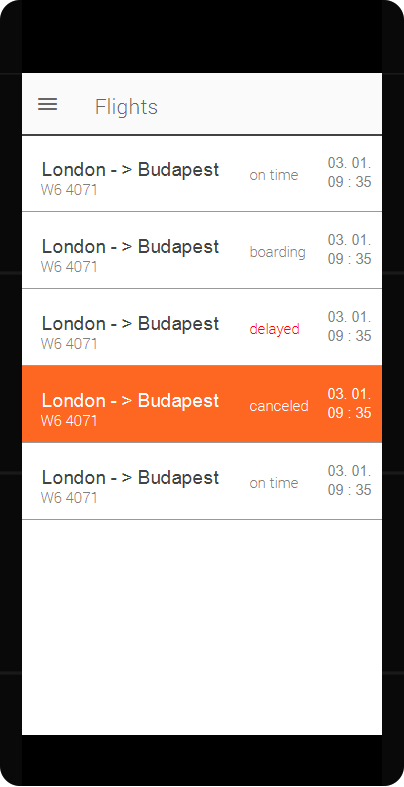

# South-Zubony International Airport (*SZIA*) application

## Tasks needs to be done
  - Create modell classes: `Airline`, `News`, `Flight`, `Complaint`
  - Create the base of the application with a `UITabBarController` or SwiftUI `TabView` with 5 view controller or `View`
  - Create arrive and depart flights screen (including save favourites)

## Introduction
Numerous individuals have expressed the need for a mobile application for South-Zubony Airport, as millions of passengers travel through Zubony daily and the airport's website leaves much to be desired. Fortunately, a robust *web API* is available for accessing flight information, and it's worth noting that the majority of Zubonyi passengers tend to use iPhones.

Within the next 8 hours, you are required to develop an application for the iOS platform using `Swift 5.8`. The minimum iOS deployment target should be `iOS 14`. While incorporating `Combine` and/or `async/await` is advantageous, it is not a mandatory requirement.

## Specification
The application contains 4 main functionality:

  - show and save flight information
  - show airport news 
  - show the airport on the map
  - complaints.

### Flight information
In the application, it is possible to view a list of departing and arriving flights. It is possible to mark individual flights as favorites, in which case it must be able to be saved in the phone's local database and displayed even without the Internet. Flight information must be downloaded from the Internet.

### News
The airport's current news should be displayed in a list: clicking on an item will display a detailed description of the news. The news must be downloaded from the Internet.

### Map
The coordinates of Zubony are the same as the coordinates of the BUTE Q building (47.4733222,19.0576915,17), the airport must be displayed on a map view.

### Complaints
It is possible to make a complaint, which means filling out and sending a form, for which it is also possible to attach a picture.

## Model
The application contains the following objects, between the bracket you can see the related data:

  - `Flight company` (*image*, *name*, *id*)
  - `Flight` (*flight number*, *id*, *departure*, *arrive*, *start city*, *destination city*, *status*, *checkin number*, *gate number*, *delay*, *comment*, *flight company id*)
  - `News` (*id*, *address*, *content*, *date*)
  - `Complaint` (*content*, *subject of complaint*, *complainant name*, *complainant email address*, *complainant complainant phone number*, *image*)

## Server

The backend of the application can be reached at [`https://szia-backend.autsoft.hu/api/`](https://szia-backend.autsoft.hu/api/). You can try out the request at [`https://szia-backend.autsoft.hu/explorer/`](https://szia-backend.autsoft.hu/explorer/). You need to use the following endpoints:

- `GET` /Airlines
- `POST` /Complaints
- `GET` /Flights
- `GET` /News

## Application screens
Each feature of the application is displayed on distinct screens situated on separate tabs. The included screens serve as rough sketches or low-fidelity wireframes to illustrate the type of data that should be displayed. As part of this task, you are encouraged to design the application according to your own preferences, based on these sketches. Familiarity with and adherence to [Apple's Human Interface Guidelines](https://developer.apple.com/design/human-interface-guidelines/designing-for-ios) is a considerable advantage.

### Arriving flights
On the first page there is a screen for arriving flights. Here you can see a list of arriving flights. The list can be updated by pressing the update button (or e.g. *swipe to refresh*), in which case the latest flight information will be downloaded from the server (optionally by *swiping* down the list). By clicking on an element, it can be marked as a favorite, which must be able to be stored in a database. This must be indicated in some way, e.g. a star or inscription.

### Departing flights
Same as arriving screen.

### News and news details
The third tab contains the news view, which displays the latest news in chronological order. Click on a news item to see its details.

### Map screen
In the map view, South Zubony is visible on the map, and by clicking on it, basic information about the airport appears.

### Complaint
On the last page you can see the complaint report, which is a *form* to be filled out. After it has been executed, it can be sent to the server by clicking the ``Send'' button. It is also possible to upload a picture to the server.
